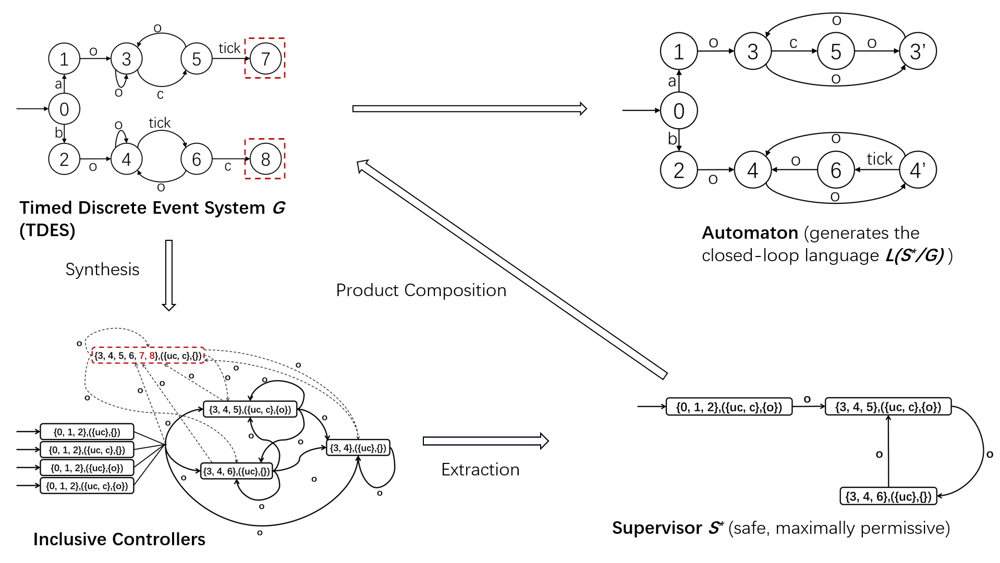

# **Research Projects**

## **Verification-aided Compiler Optimization**

[Note: This project has an equally contributing co-author [Hanzhi Liu](https://misaka.center/), also advised by Qinxiang Cao, to implement this optimization and framework in a concrete separation logic based on VST [Verified Software Toolchain]

We are designing a new method of program optimization for C programs with assertion annotated that contains verification information of the program. The new methods was being realized based on original [CompCert](http://compcert.inria.fr/) compiler. New semantics framework was designed based on CompCert small step semantic framework.  An extended framework of source/target program simulation diagram with "Virtual/Real Tags" for compiler correctness was proposed and implemented.

This is an original work of our research group under exploration, so details are still not opened to the public.

## **Finite Canonical Model for Completeness Theory in Coq Based on UnifySL**:

[UnifySL](https://github.com/QinxiangCao/UnifySL) is a library of the proof assistant [Coq](https://coq.inria.fr/) designed for basic mathematical logic (e.g. Propositional Logics, Separation Logics etc.) under development (not open sourced for now). Formalized proof theories, semantic definitions, soundness proofs and completeness proofs were abstractly described using Coq's type classes and high-order features. The completeness proof of previous various logic systems are all based on the framework of infinite canonical model.

My work as a research assistant aimed to investigate the finite model methods, starting the exploration from the formalizing of propositional dynamic logic (PDL), including the proof theories, semantic definitions, the proof of its soundness and  the proof of its weak completeness, making the best of framework and tools in UnifySL. Currently the completeness proof was finished, and we expect to extract a new framework of high-order abstraction for finite model methods in the future. 

During my work, a lot of useful lemmas was also proved as a supplementary of the UnifySL library. 

## **Supervisor Control of Timed Discrete-Event Systems**

The supervisory control theory of Discrete Event Systems (DES) is a formal framework for the synthesis of control logic for complex automated systems. We investigated the supervisory control problem for timed discrete-event systems (TDES) under partial observation where time was considered as a special event. The design objective is to synthesize a maximally-permissive supervisor to restrict the behavior of the system such that the closed-loop language is within a safe specification language. Relevant paper was accepted by [21st IFAC World Congress, 2020](https://www.ifac2020.org/).
We also hope to investigate the non-blocking problem employing nondeterministic control method in the future.

The following figure illustrates our main process of synthesizing such safe and maximally permissive supervisory. 

Here is our [video report](https://youtu.be/GtbxR_OKfXU) at [IFAC2020](https://www.ifac2020.org/) uploaded to YouTube.

