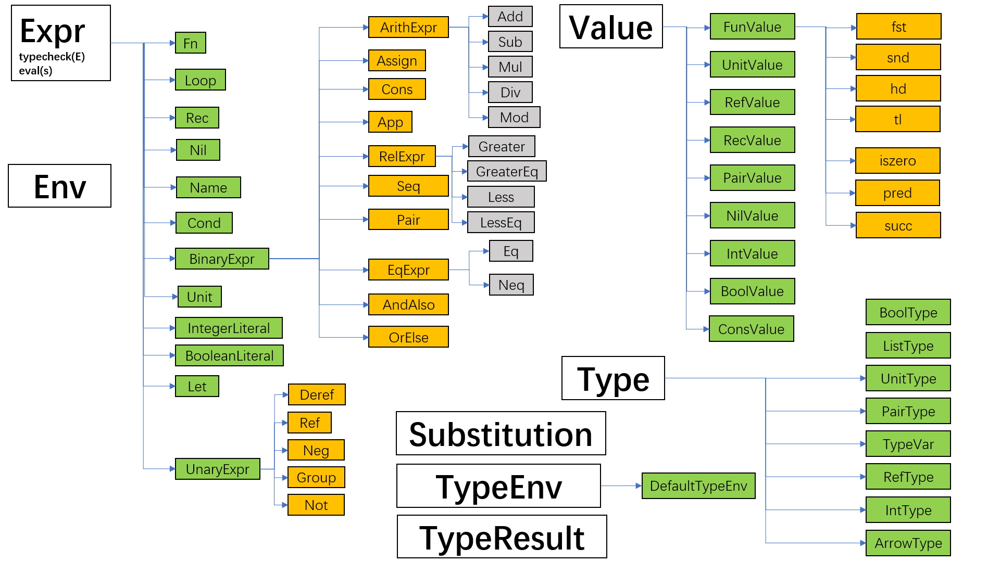

# **Research Projects**

## **Verification-aided Compiler Optimization**

We are considering a new method of program optimization for C programs with annotation that contains the verification information of the program.  A conditional definition of "forward simulation" and "backward simulation"  for compiler correctness was proposed with crucial properties proved formally in Coq. The new methods was being realized based on [CompCert](http://compcert.inria.fr/) compiler. We also implemented a translation path from annotated CompCert C source language to annotated RTL intermediate language. 

Further details are confidential currently.


## **Formalization of Completeness Proof of Propositional Dynamic Logic in Coq**

[UnifySL](https://github.com/QinxiangCao/UnifySL) is a library of the proof assistant [Coq](https://coq.inria.fr/) for logic under development (not open sourced for now). Formalized proof theories, semantic definitions, soundness proofs and completeness proofs of minimum logics, propositional logics and separation logics were realized using Coq's type classes and high-order features. The completeness proof of previous logics are all based on the framework of infinite canonical model.

My work aimed to investigate the finite model methods, starting the exploration from the formalizing of propositional dynamic logic (PDL), including the proof theories, semantic definitions, the proof of its soundness and  the proof of its weak completeness, making the best of framework and tools in UnifySL. Currently the completeness proof was finished, and we expect to extract a new framework of high-order abstraction for finite model methods in the future. 

During my work, a lot of useful lemmas was also proved as a supplementary of the UnifySL library. 


The following are the critical definitions and lemmas:

- The abstract type class of PDL

  ```ocaml
  Class Program : Type:={
    program: Type;
  }.
  
  Class PropositionalDynamicLanguage (L:Language)(Pro: Program):Type:={
    boxp: program -> expr -> expr
  }.
  
  Class ProgramOperation (L:Language)(Pro:Program):Type:= {
    choice: program -> program -> program;
    composition: program -> program -> program;
    iteration: program -> program;
    test: expr -> program
  }.
  ```

- The deep-embedded syntax of PDL

  ```ocaml
  Inductive program {Sigma: PropositionalVariables}{ProV: ProgramVariables}: Type :=
    | choice: program -> program -> program
    | composition: program -> program -> program
    | iteration: program -> program
    | test: expr -> program
    | basep: BaseP -> program
  with
   expr {Sigma: PropositionalVariables} {ProV: ProgramVariables}: Type :=
    | impp : expr -> expr -> expr
    | orp : expr -> expr -> expr
    | andp: expr -> expr -> expr
    | falsep : expr
    | boxp: program -> expr -> expr
    | varp : Var -> expr
  .
  ```

  

- The *Truth Lemma* and *Existence Lemma* (mutually inductively):

  ```ocaml
  Lemma TRUTH_LEMMA:
    forall (psi x: exp) m Phi,
      rel psi m Phi -> 
        FL_closure_construction psi x ->
          (KRIPKE: canonical_Kmodel psi, m |= x <-> proj1_sig Phi x)
  with EXISTENCE_LEMMA:
    forall (pi: prog)(psi x: exp)(m : Kworlds (canonical_Kmodel psi)),
      FL_Atom psi (proj1_sig m) -> 
        FL_closure_construction psi ([pi]x) ->
          (proj1_sig m ([pi]x) <-> forall n, R_D pi m n -> proj1_sig n x).
  ```

  

-  The *Weak Completeness* Theorem

  ```ocaml
  Theorem complete_weakly: weakly_complete GP SM (KripkeModelClass _ kMC).
  ```


## **Supervisor Control of Timed Discrete-Event Systems**

The supervisory control theory of Discrete Event Systems (DES) is a formal framework for the synthesis of control logic for complex automated systems. We investigated the supervisory control problem for timed discrete-event systems (TDES) under partial observation where time was considered as a special event. The design objective is to synthesize a maximally-permissive supervisor to restrict the behavior of the system such that the closed-loop language is within a safe specification language. Relevant paper was accepted by [21st IFAC World Congress, 2020](https://www.ifac2020.org/).
We also hope to investigate the non-blocking problem employing nondeterministic control method in the future.


The following figure illustrates our main process of synthesizing such safe and maximally permissive supervisory.


Here is our [video report](https://youtu.be/GtbxR_OKfXU) at [IFAC2020](https://www.ifac2020.org/) uploaded to Youtube.


---


# **Other Projects** 

[**SimPL Interpreter**](https://github.com/Youngzt998/SimPL-Interpreter): an interpreter for a simple programming language called *SimPL*,  a simplified dialect of *ML*, including *type checking* (including let-polymorphism) and *evaluation*.

- Examples of  SimPL

  - Recursive combinator:

    ```ocaml
    let gcd = rec g => fn a => fn b =>
                if b=0 then a else g b (a % b)
    in  gcd 34986 3087
    end
    (* ==> 1029 *)
    ```

  - Let-polymorphism: 

    ```ocaml
  let a = fn x => x in 
        let b = a 1 in 
            let c = a false in 
                if c then b else 0
            end
        end
    end
    (* ==> 0 *)
    ```
  
- Structure of Principle Data Structures for Implementation:
  



​    

---

[**Naive-Airdrop**](https://github.com/Youngzt998/Naive-Airdrop) 

- An application for encrypted file synchronization between PC and Android under the same wi-fi.  
- Features: auto connection, changes detecting of the observed files on client devices, encryption in transfer, both auto transmission and manual transmission etc.


---

[**Linux (Android) Memory Management**](https://github.com/Youngzt998/Operating-System-Projects/tree/master/2)  

- Replacement of the original page replacement algorithm with a new one in a given specification.
-  See a detailed instruction (also a report) for beginner of (Linux) Operating System kernel investigation [here](./projects/os-prj-linuxmm/Instruction.pdf).


---

[**In The Garden**](https://youtu.be/2D67W584gpU) 

- A mini puzzle game (Chinese version only). 

- See the video record of the whole game on [Youtube](https://youtu.be/2D67W584gpU)


---

[**Re-implementation of *deque* and *map* of  C++ Standard Template Library (STL)**:](https://github.com/Youngzt998/Re-implementation-of-deque-and-map) Re-implement the data structure *deque* (using Block List) and *map* (using AVL Tree) of C++ Standard Library, simulating most of their original designed functions. 


